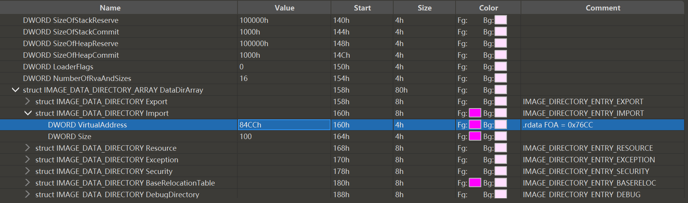
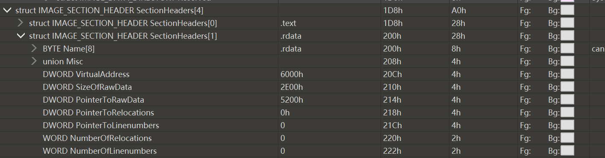
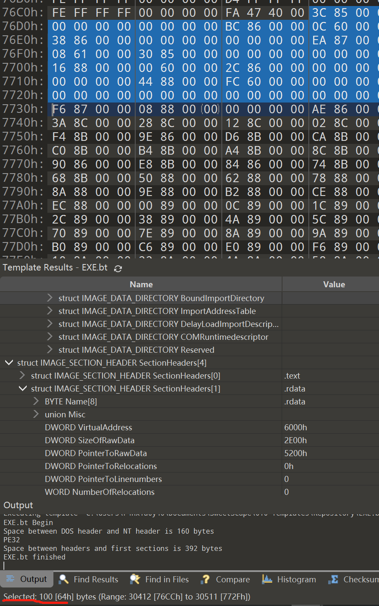
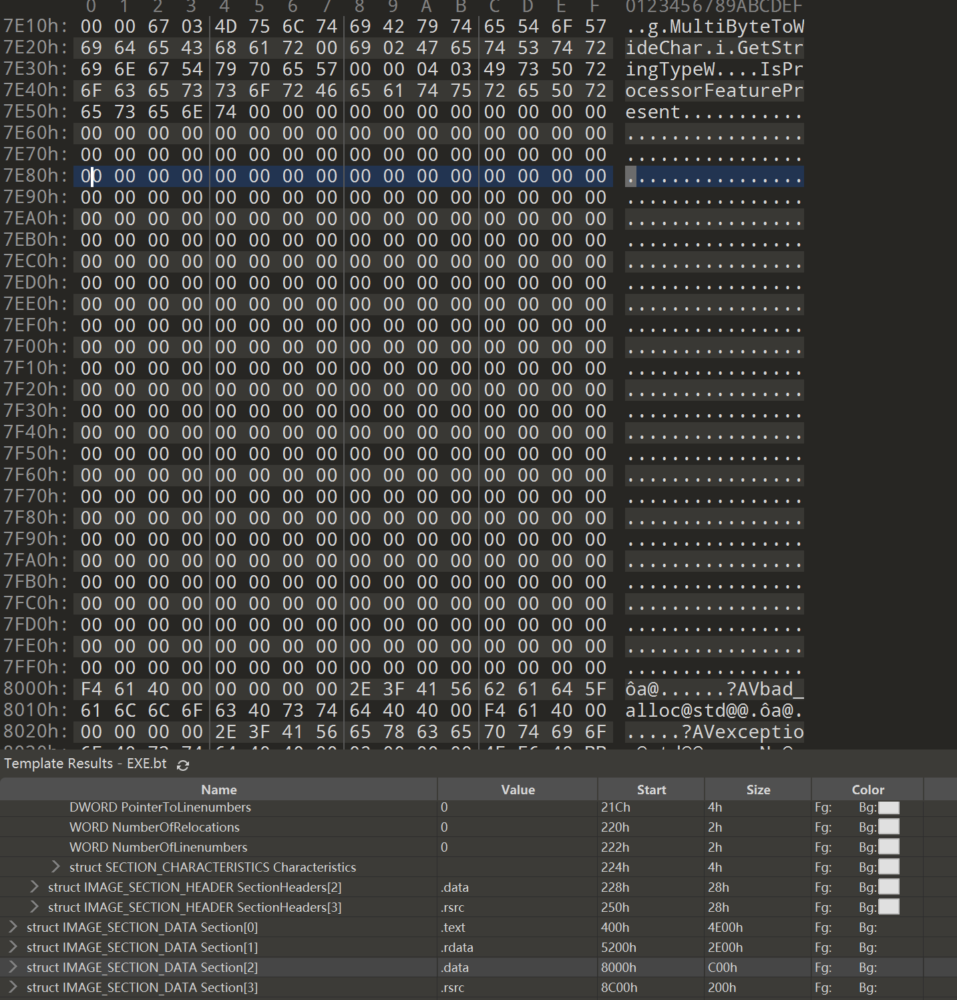
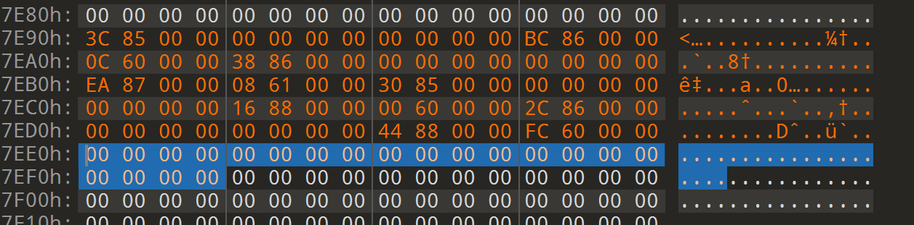
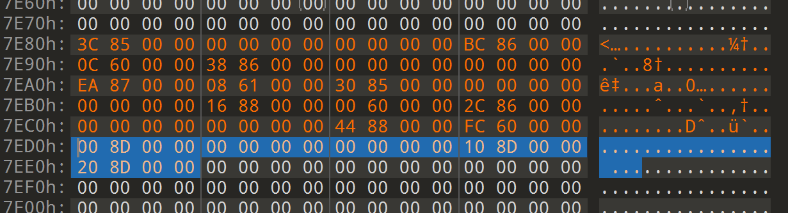
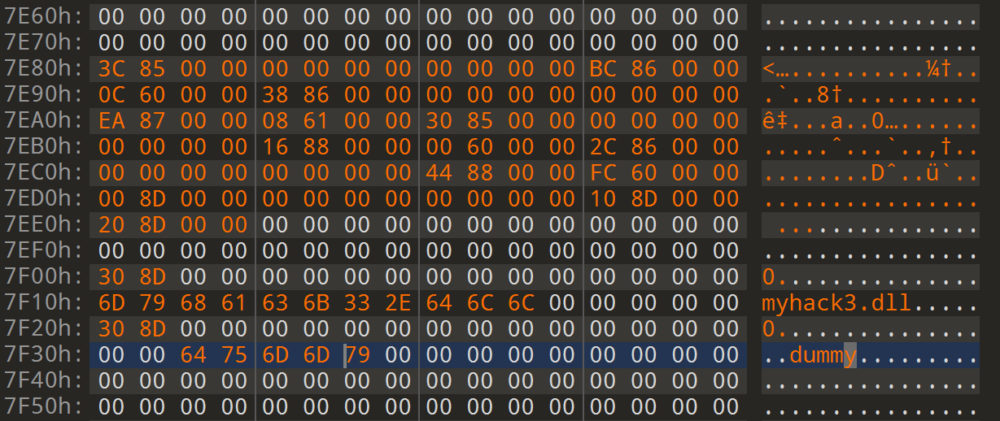
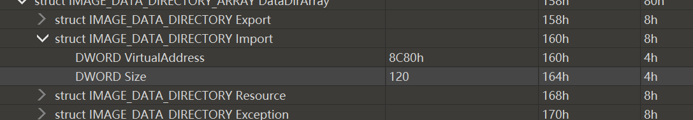
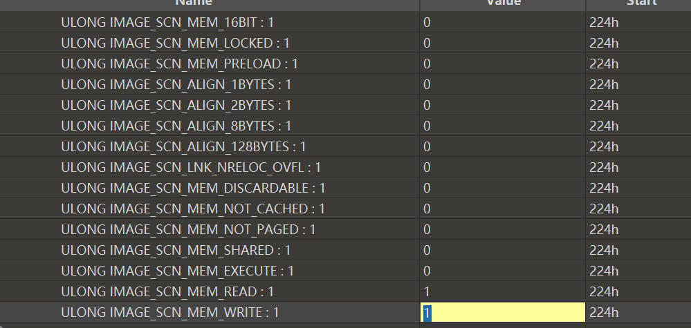

# PE_Install_Dll

解释一下文件中的一些关键函数：

**以下三个为一组，达到了找到调用此函数窗口句柄的目的**

- GetCurrentProcessId 返回调用此函数的进程的PID

- EnumWindows 枚举窗口，将每个窗口的句柄传递给回调函数EnumWindowsProc()，并且把需要对比的dwPID也传递给回调函数。

- GetWindowThreadProcessId 通过某一窗口句柄，检索创建窗口的线程/进程标识符

**以下三个为一组，达到下载网页的目的**

- InternetOpen 设置User Agent，Proxy等，初始化操作

- InternetOpenUrl 使用InternetOpen()返回当前Internet会话的句柄打开资源

	- INTERNET_FLAG_RELOAD 参数表示强制从源服务器下载请求的文件、对象或目录列表

- InternetReadFile 从InternetOpenUrl()打开的句柄中读取数据


### 通过修改PE文件的方式导入DLL

**我们需要修改IDT表，增加一条我们字节DLL文件的IID以达到导入的目的。**

在NT头下IMAGE_DATA_DIRECTORY_ARRAY结构体，找到导入表，导入表第一个参数的值便为IDT的RVA



RVA是程序的相对虚拟地址，我们要想在文件中精确定位IDT，必须要把RVA转位RAW，在上图中也叫FOA(文件偏移，文件中某个位置距离文件头的偏移)，具体的计算公式：

- RAW = RVA - VirtualAddress + PointerToRawData

84CCh属于.rdata节区，VirtualAddress 和PointerToRawData可从节区头中获取。



VirtualAddress 是指文件运行后装在在内存中的起始位置，PointerToRawData是指该节区在磁盘中的起始位置。计算得RAW=76CCh。

切换到该区域，IDT大小为100字节（图一第二个Size变量）。



我们要修改的主要就是这个部分，并且IDT是由IMAGE_IMORT_DESCRIPTOR（IID）结构体组成的数组

具体的定义如下：

```c++
typedef struct _IMAGE_IMORT_DESCRIPTOR{
    union{
        DWORD Characteristics;
        DWORD OriginalFirstThunk;  // RVA to INT(Import Name Table)
    }
    DWORD TimeDateStamp;
    DWORD ForwarderChain;
    DWORD Name;						// RVA to DLL Nmae String
    DWORD FirstThunk;				// RAV to IAT(Import Address Table)
}
```

每个结构体20字节，IDT大小为100字节，也就是说有五个IID结构体（默认最后一个结构体为NULL），我们需要新加一个IID来导入我们自己编写的DLL文件，但是这片区已经没有Null-Padding区域供我我们新加IID，所以我们需要整体把IDT移动到一片新的Null-Padding区域。

在.rdata区域末尾，有一片Null-Padding区域，那么就选择这篇区域作为IDT的新地址。



把之前的数据复制过来。



我标注的地方是需要添加新的IID的，原本是之前的NULL结构体，现在我们把它换成我们需要添加的DLL对应的结构体。

观察一下结构体的定义，第一个为共用结构体，还有四个DWORD类型变量。

1. OriginalFirstThunk代表指向INT(Import Name Table)的RVA地址。

2. TimeDateStamp设置为NULL。

3. ForwarderChain设置为NULL。

4. Name变量即我们想要添加的DLL的文件名。

5. FirstThunk为指向IAT（Import Address Table）的RVA。

这边我们为了方便，就把1、4、5的值设置为指向相邻的Null-Padding区域，如下图所示



注意，这里的**8D00h、8D10h、8D20h**为RVA，而上图左边的引导列为RAW。所以前述的三个值是通过RAW反推来的RVA，他们的RAW分别是**7F00h、7F10h、7F20h**，也就是在IDT的下方。

8D00h指向的INT的元素实际上也是一个指向 **IMAGE_IMPORT_BY_NAME **结构体的指针，定义如下：

```c++
typedef struct _IMAGE_IMPORT_BY_NAME{
    WORD Hint;
    BYTE Name[1];
}IMAGE_IMPORT_BY_NAME, *PIMAGE_IMPORT_BY_NAME
```

所以我们把8D00h处的INT设置为8D30h，也就是前面所述位置的在下面一行。

8D10h处为DLL文件名的16进制ASCll码。

8D20h处IAT可以选择与INT一样的值，因为程序运行时，PE装载器会把虚拟内存中的IAT替换为实际函数的地址。但是因为我们的IAT存在于.rdata段，一般这个字段是没有写属性的，所以后面还要给这个字段加上写属性。

8D30h（RAW：3F30h）指向的 IMAGE_IMPORT_BY_NAME 结构体为一个WORD类型的hint和需要导入的函数名组成，由于我们的DLL文件就一个导出函数，所以hint值为0。

按照上述修改后：



dummy便是我DLL文件的导出函数。

至此 IDT 的修补工作完成了一大半，接下来我们需要把新的IDT地址写回NT头中导入表。我们新IDT的起始位置RAW为7E80h，转为RVA后为：8C80h。表大小为120字节（因为只加了一个IID）。



然后更改.rdata的头，使其可写。



至此，完成了添加DLL文件的操作。
